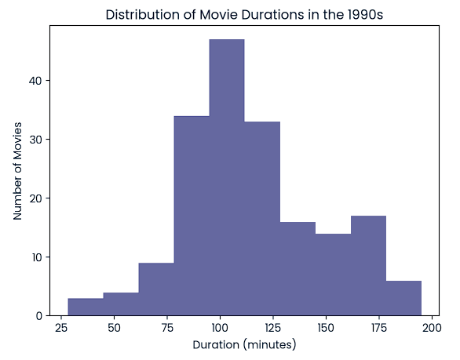

# 🎬 Netflix 90s Movies — Exploratory Data Analysis

> **DataCamp Guided Project — Python & pandas**  
> Exploratory analysis of Netflix's catalog focused on movies released in the 1990s, built for a fictional production company specializing in nostalgic content.

---

## 📌 Project Overview

A production company specializing in nostalgic styles needed insights into the 1990s movie landscape on Netflix. This project filters and analyzes the Netflix catalog to uncover duration trends and ge[...]

**Questions answered:**
- What is the most common movie duration for 90s films on Netflix?
- How are movie durations distributed across the decade?
- How many short Action movies (<90 min) were released in the 1990s?

---

## 🗂️ Dataset

**File:** `netflix_data.csv` — 4,812 rows, 11 columns

| Column | Description |
|---|---|
| `show_id` | Unique show identifier |
| `type` | Movie or TV Show |
| `title` | Title of the show |
| `director` | Director |
| `cast` | Cast members |
| `country` | Country of origin |
| `date_added` | Date added to Netflix |
| `release_year` | Year of release |
| `duration` | Duration in minutes |
| `description` | Show description |
| `genre` | Genre category |

---

## 🛠️ Tools


---

## 📊 Key Findings

After filtering the full catalog down to **183 movies released between 1990–1999:**

**Duration distribution:** The most frequent movie duration is **94 minutes**, with the bulk of 90s films falling between 85–120 minutes — consistent with the era's theatrical standard.

**Short Action movies:** Only **7 Action movies** from the 1990s run under 90 minutes, confirming that the decade favored longer, blockbuster-style action films.

**Top genres in the 90s Netflix catalog:**

| Genre | Count |
|---|---|
| Action | 48 |
| Dramas | 44 |
| Comedies | 40 |
| Children | 15 |
| Classic Movies | 15 |

### 📈 Duration Distribution Visualization



---

## 💡 Analysis Approach

```python
# Filter to 90s movies only
movies_1990s = netflix_df[
    (netflix_df['type'] == 'Movie') &
    (netflix_df['release_year'] >= 1990) &
    (netflix_df['release_year'] < 2000)
]

# Visualize duration distribution
plt.hist(movies_1990s['duration'])
plt.title('Distribution of Movie Durations in the 1990s')
plt.xlabel('Duration (minutes)')
plt.ylabel('Number of Movies')

# Count short action movies using a for loop
short_movie_count = 0
for label, row in action_movies_1990s.iterrows():
    if row['duration'] < 90:
        short_movie_count += 1
```

---

## 📁 Repository Structure

```
netflix-90s-eda/
├── notebook.ipynb
├── README.md
├── data/
│   └── netflix_data.csv
└── charts/
    └── duration_distribution_90s.png
```

---

## 👤 Author

**Leonardo Farfán** · Associate Data Analyst · DataCamp Certified  
[LinkedIn](https://linkedin.com/in/leofarfan) · leofarfan2604@gmail.com

*DataCamp Guided Project — Introduction to Python for Data Science*
